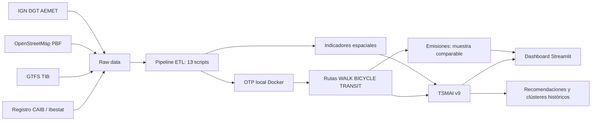

# Accesibilidad turística y movilidad sostenible en Mallorca

Prototipo reproducible de Spatial Data Science y Business Intelligence para analizar la conexión entre alojamientos turísticos, destinos de interés y modos sostenibles en Mallorca. Es el artefacto técnico de un Trabajo Fin de Máster en Data Science, Big Data e Inteligencia Artificial (UCM).

El sistema integra fuentes abiertas, ejecuta rutas reales con OpenTripPlanner (OTP) y convierte el resultado en un **dashboard analítico de negocio**. Sus resultados sirven como herramienta de apoyo a la decisión para la planificación de inversiones en infraestructura, estrategias de turismo sostenible y reducción de emisiones.

## Resultados principales (TSMAI v9)

- **1.463 alojamientos con geometría válida** y **1.423 destinos turísticos OSM nombrados** en la línea base; el TSMAI V9 evalúa 1.461 alojamientos de un snapshot oficial posterior sometido a control espacial.
- **78,88% de alojamientos** y **65,50% de destinos** a 800 m o menos de una parada GTFS.
- **Transición a TSMAI v9**: evaluación estacional de la disponibilidad de transporte público, comparando escenarios reales de verano e invierno.
- **Pipeline ETL modular**: 13 scripts versionados para ingesta, topografía, clima, ruteo multimodal (OTP) y consolidación de indicadores.
- **Dashboard de negocio**: interfaz orientada a cliente con KPIs dinámicos, segmentación K-Means, interactividad bidireccional en mapas y síntesis ejecutiva automática.
- **2,844 kg CO₂eq evitados estimados** en una muestra de seis pares coche-autobús comparables, con factores de emisión declarados.

## Arquitectura de datos



## Inicio rápido en Windows

Desde la carpeta raíz del proyecto:

```powershell
# 1. Activar el entorno
conda activate tfm-mallorca

# 2. Levantar el motor de rutas (requiere Docker)
docker compose -f docker/otp/docker-compose.yml up -d otp-server

# 3. Lanzar el dashboard
streamlit run app/streamlit_app.py
```

Abre `http://localhost:8501`. Para consultar instrucciones, geometrías de ruta exactas o isócronas, el contenedor de OTP debe estar activo.

Para ejecutar las pruebas automatizadas de la lógica de negocio:

```powershell
pytest
```

## Datos, licencias y alcance

La arquitectura separa los datos en capas (`raw`, `unified` y `curated`). Las fuentes, atribuciones y condiciones de reutilización se documentan en [docs/FUENTES_Y_LICENCIAS.md](docs/FUENTES_Y_LICENCIAS.md).

La meteorología AEMET requiere una clave personal. No se incluyen datos brutos protegidos ni credenciales en el repositorio.

## Documentación principal

- [Operación del producto](docs/OPERACION_PRODUCTO.md)
- [Reproducibilidad operativa y universos de análisis](docs/REPRODUCIBILIDAD_OPERATIVA.md)
- [Metodología y versiones del TSMAI](docs/TSMAI_METODOLOGIA_VERSIONADA.md)
- [Resultados y discusión V9 para la memoria](docs/MEMORIA_RESULTADOS_V9.md)
- [Justificación de pesos y sensibilidad V9](docs/JUSTIFICACION_PESOS_TSMAI_V9.md)
- [Validación final de entrega V9](docs/VALIDACION_FINAL_ENTREGA_V9.md)
- [Tablas para la defensa V9](docs/TABLAS_DEFENSA_V9.md)
- [Guía de capturas de defensa](docs/GUIA_CAPTURAS_DEFENSA.md)
- [Protocolo de validación de campo V9](docs/PROTOCOLO_VALIDACION_CAMPO_V9.md)
- [Resultados y discusión](docs/borrador_resultados_y_discusion.md)
- [Dashboard y capacidades](docs/dashboard_streamlit.md)
- [Fuentes y licencias](docs/FUENTES_Y_LICENCIAS.md)
